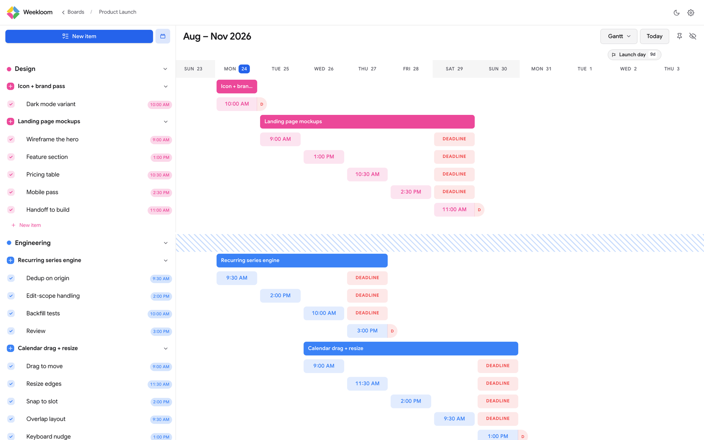
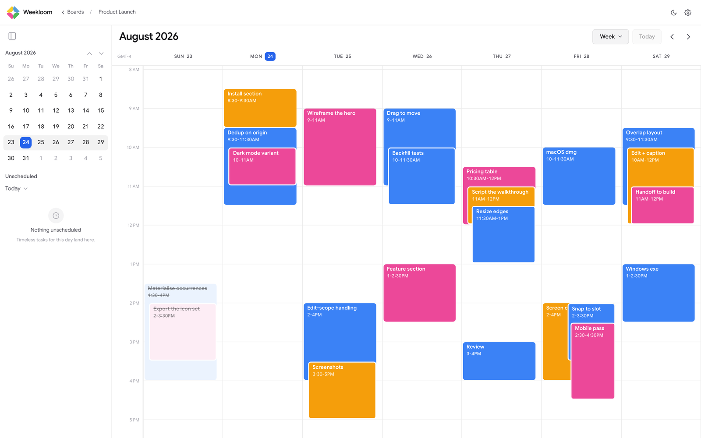
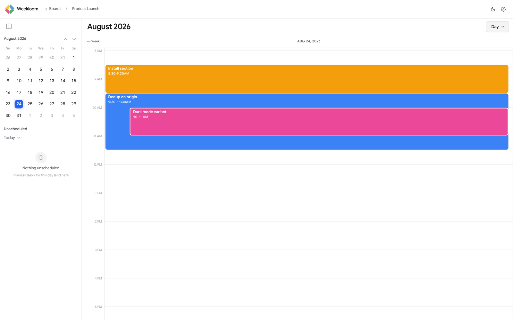

# Weekloom

A Gantt-chart planner that runs entirely on your own computer: a **board** holds **blocks** (lanes),
a block holds **tasks**, a task spans **steps**, one per day. No account, no sign-in, no network
requests — your whole plan is one SQLite file at `~/.weekloom/weekloom.db`; copy that folder to back
it up, delete it to start over.



The same plan, three ways. Give a step a time and it appears on the calendar; finish it and it
strikes through.

| Week                           | Day                          |
| ------------------------------ | ---------------------------- |
|  |  |

## Install

### macOS — Homebrew

```bash
brew install --cask moizdev/weekloom/weekloom
```

That is the whole thing — it taps, downloads and installs, and Weekloom is in your Applications
folder, ready to open. Apple Silicon and Intel both covered.

Weekloom is ad-hoc signed rather than notarized with a paid Apple Developer ID, so macOS would
normally quarantine it and claim it is _"damaged"_. It is not — the cask clears that flag during
install, so the app just opens.

`brew upgrade --cask weekloom` updates and `brew uninstall --cask weekloom` removes it. Neither
touches `~/.weekloom`, so your plan survives both. The cask itself lives in
[MoizDev/homebrew-weekloom](https://github.com/MoizDev/homebrew-weekloom) — Homebrew requires a tap
repository to be named `homebrew-<name>`, which is why it is not in this one.

#### If you downloaded the `.dmg` instead

macOS will tell you **"Weekloom is damaged and can't be opened. You should move it to the Trash."**

**It is not damaged, and you should not trash it.** That message is what macOS says about any app
that is not signed with a paid Apple Developer ID, whether it is broken or perfectly fine — it
cannot tell the difference, so it assumes the worst. Drag Weekloom to your Applications folder,
then run this once:

```bash
xattr -dr com.apple.quarantine /Applications/Weekloom.app
```

It opens normally afterwards, and you never need to do it again. Installing with `brew` above skips
this entirely, because the cask clears the flag for you.

### Windows and Linux

**Homebrew does not exist on Windows**, so there is no `brew` line to give you. Download the
installer for your platform from [Releases](https://github.com/MoizDev/weekloom/releases):
`.exe` on Windows, `.AppImage` or `.deb` on Linux. Windows SmartScreen will warn about an unknown
publisher for the same reason macOS does — "More info" → "Run anyway".

### From source

You need [Node.js](https://nodejs.org) 24+ — `node:sqlite` is built in, so there is no native
module to compile.

```bash
npm install
npm run dev        # browser, hot reload → http://localhost:3000/app
npm run app:start  # the actual desktop app, in its own window
npm run package    # an installer for the platform you are on; no cross-compiling
npm test           # unit tests — lib/ and tests/ ONLY
npm run app:build && npm run test:e2e   # everything else, against a real build
```

⚠️ `npm run dev` uses your real `~/.weekloom`; prefix `WEEKLOOM_DATA_DIR=/tmp/weekloom-dev` to avoid that.

`npm run package` puts **two** things in `release/`: the installer (`Weekloom-<version>.dmg` on
macOS, `.exe` on Windows, `.AppImage`/`.deb` on Linux) and, beside it, the unpacked application —
on macOS `release/mac-arm64/Weekloom.app` — which is what to launch to check a packaged build.

The e2e suite never touches `~/.weekloom` (throwaway database under your temp directory) and never
packages or installs anything — but it does overwrite your in-repo build output, `.next/standalone/`
and `electron/dist/` (both gitignored), and its Electron spec launches that, not `release/`.

Before a PR run `npm run typecheck && npm run lint && npm test`, plus `npm run test:e2e` if you
touched `components/` or `electron/`. Architecture notes: [`AGENTS.md`](AGENTS.md). MIT licensed.
